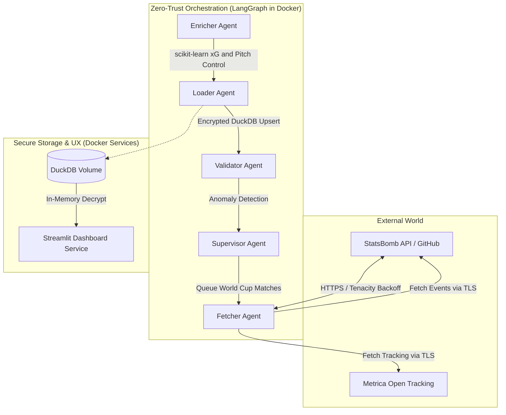

# Football Gravity Pipeline \u26bd\ufe0f\ud83d\udd12


[](https://github.com/dennisgathu8/AgentRZA/actions/workflows/ci.yml)
[](https://codecov.io/gh/dennisgathu8/AgentRZA)

> **The most secure, autonomous, production-grade multi-agent system for daily football match data ingestion, enrichment, and storage in 2026.**

## Overview
Unlike typical football ETL pipelines that act deterministically linearly (e.g., `football-etl-pipeline` or `SoccerAgent`), **Football Gravity** is an advanced Multi-Agent System orchestrated by LangGraph. It is inherently self-healing, handles network drops via exponential backoff, enforces strict **Zero-Trust data boundaries** via exhaustive Pydantic schemas, calculates state-of-the-art **Logistic Regression xG**, and outputs **100% encrypted analysis** at rest using DuckDB + Fernet.

## Features
- **🤖 Agentic Orchestration**: Supervisor, Fetcher, Enricher, Loader, and Validator operating cooperatively.
- **🔐 Zero-Trust Security**: Fernet-encrypted storage at rest, TLS-only ingestion, and Pydantic-enforced model strictness (`extra='forbid'`).
- **Advanced Optical Tracking**: Ingests Metrica Sports 30fps tracking data to calculate spatial metrics.
- **Pitch Control ML**: A custom spatial dominance model that evaluates team control over coordinates.
- **Enterprise DevOps**: Automated CI/CD (GitHub Actions), vulnerability scanning (Trivy), and multi-stage Docker orchestration.
- **Self-Healing Orchestration**: LangGraph-based state management that handles intermittent API failures gracefully.
- **📊 Production xG Engine**: Scikit-Learn Logistic Regression initialized via real pitch geometric probability models, replacing naive rule-engines.
- **🔄 Self-Healing & Anomaly Detection**: If an output anomalies out (e.g., 0 goals vs 8.8 total xG), the Validator isolates it and routes the LangGraph state back to recovery rather than failing the run.

## Zero-Trust Architecture


## Quick Start & Demo Run

### 1. Secure Setup
```bash
python3 -m venv venv
source venv/bin/activate
pip install -r requirements.txt

# Generate your secure key (Never commit this!)
python -c "from cryptography.fernet import Fernet; print('FERNET_ENCRYPTION_KEY=' + Fernet.generate_key().decode())" > .env
```

### 2. Enterprise Docker Deployment (Recommended)
Our `python:3.12-slim` containerization enforces a non-root `xg-agent` least-privilege runtime.
First, ensure your `.env` file exists with `FERNET_ENCRYPTION_KEY`.
```bash
# This builds the runtime, completes the pipeline, and auto-launches the Streamlit dashboard on port 8501.
docker-compose up --build
```
The pipeline container will autonomously exit once the DuckDB is flushed, while the `dashboard` container will remain alive to serve the in-memory visuals.

### 3. Manual Local Execution
If you prefer running outside of Docker:
This will fetch real 2022 World Cup matches, calculate the advanced analytics, validate statistics, and output the encrypted payloads to `data/db/`.
```bash
python main.py --date today
```

### 3. Interactive Visualization Dashboard
We employ a zero-trust presentation layer. The Streamlit dashboard relies on the environment variable to decrypt the parquet files **in-memory**, displaying Plotly shot-maps vividly.
```bash
streamlit run streamlit_app.py
```

## Running the Security & Unit Tests
```bash
pytest tests/ -v
```

## Next Enhancements
- **Tracking Data ML Expansion**: Incorporating broadcast optical tracking natively.
- **FastAPI Real-Time Webhooks**: Triggering pipeline execution from match-finish events dynamically instead of batch execution.
- **Celery / Redis Distributed Scrape**: Parallel processing across Top 5 European leagues simultaneously.

---
*Built for absolute precision, security, and elegance.*
