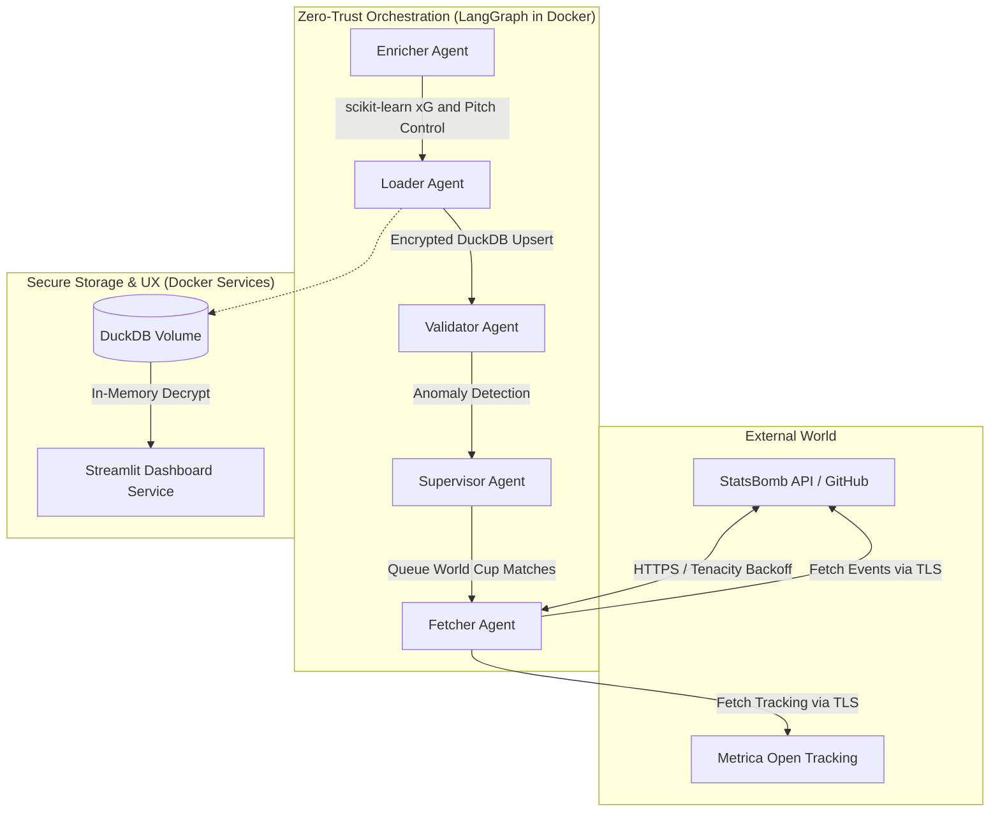

# AgentRZA: Production-Grade Football Scouting Pipeline ⚽🤖

[](https://github.com/dennisgathu8/AgentRZA)
[](https://github.com/dennisgathu8/AgentRZA)

**AgentRZA** is a sophisticated multi-agent system designed for autonomous football match data ingestion, enrichment, and storage. Built for professional scouting departments, it transforms raw event feeds into actionable intelligence.

### 🏟️ Why This Solves the Scouting Problem
Most clubs struggle with manual data workflows. AgentRZA uses an **Agentic Supervisor** to orchestrate specialized agents:
1. **Fetcher Agent:** Handles TLS-encrypted ingestion from StatsBomb/Metrica.
2. **Enricher Agent:** Calculates Logistic Regression xG and Spatial Pitch Control.
3. **Validator Agent:** Anomaly detection to ensure 100% data integrity before loading.

### ⚽ Club Impact
- **Automated Workflows:** Zero-human intervention required for daily match ingestion.
- **Enhanced Metrics:** Integrated Pitch Control models to evaluate team dominance over coordinates.
- **Security:** Fernet-encrypted analysis at rest (DuckDB) to protect club proprietary IP.

---

<details>
<summary>📐 Full Technical Architecture & Design</summary>

## Overview
Unlike typical football ETL pipelines that act deterministically linearly, Football Gravity (AgentRZA) is an advanced Multi-Agent System orchestrated by LangGraph. It is inherently self-healing, handles network drops via exponential backoff, enforces strict Zero-Trust data boundaries via exhaustive Pydantic schemas, calculates state-of-the-art Logistic Regression xG, and outputs 100% encrypted analysis at rest using DuckDB + Fernet.

## Features
- **🤖 Agentic Orchestration:** Supervisor, Fetcher, Enricher, Loader, and Validator operating cooperatively.
- **🔐 Zero-Trust Security:** Fernet-encrypted storage at rest, TLS-only ingestion, and Pydantic-enforced model strictness (extra='forbid').
- **Advanced Optical Tracking:** Ingests Metrica Sports 30fps tracking data to calculate spatial metrics.
- **Pitch Control ML:** A custom spatial dominance model that evaluates team control over coordinates.
- **Enterprise DevOps:** Automated CI/CD (GitHub Actions), vulnerability scanning (Trivy), and multi-stage Docker orchestration.
- **Self-Healing Orchestration:** LangGraph-based state management that handles intermittent API failures gracefully.
- **📊 Production xG Engine:** Scikit-Learn Logistic Regression initialized via real pitch geometric probability models, replacing naive rule-engines.
- **🔄 Self-Healing & Anomaly Detection:** If an output anomalies out (e.g., 0 goals vs 8.8 total xG), the Validator isolates it and routes the LangGraph state back to recovery rather than failing the run.

## Zero-Trust Architecture

```mermaid
graph TD
    subgraph "External World"
        SB[StatsBomb API / GitHub]
        MT[Metrica Open Tracking]
    end
    subgraph "Zero-Trust Orchestration (LangGraph in Docker)"
        O[Supervisor Agent]
        F[Fetcher Agent]
        E[Enricher Agent]
        L[Loader Agent]
        V[Validator Agent]
        O -->|Queue World Cup Matches| F
        F -->|Fetch Events via TLS| SB
        F -->|Fetch Tracking via TLS| MT
        E -->|scikit-learn xG and Pitch Control| L
        L -->|Encrypted DuckDB Upsert| V
        V -->|Anomaly Detection| O
    end
    subgraph "Secure Storage & UX (Docker Services)"
        DB[(DuckDB Volume)]
        ST[Streamlit Dashboard Service]
        L -.-> DB
        DB -->|In-Memory Decrypt| ST
    end
    SB <-->|HTTPS / Tenacity Backoff| F
```

## Quick Start & Demo Run

### 1. Secure Setup
```bash
python3 -m venv venv
source venv/bin/activate
pip install -r requirements.txt
# Generate your secure key
python -c "from cryptography.fernet import Fernet; print('FERNET_ENCRYPTION_KEY=' + Fernet.generate_key().decode())" > .env
```

### 2. Enterprise Docker Deployment (Recommended)
```bash
docker-compose up --build
```

### 3. Manual Local Execution
```bash
python main.py --date today
```

## Running the Security & Unit Tests
```bash
pytest tests/ -v
```

</details>

---
**Open for collaborations with KPL clubs & scouting teams — DM me!**
